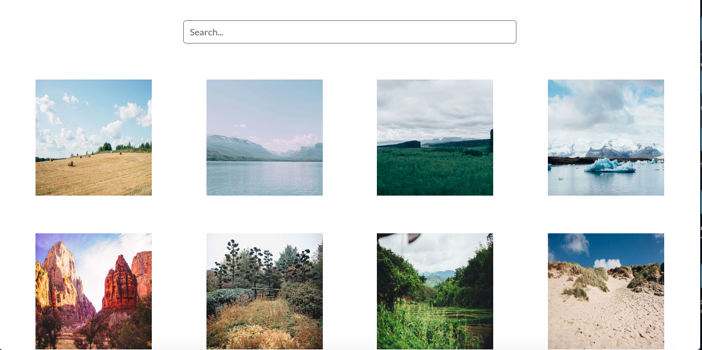
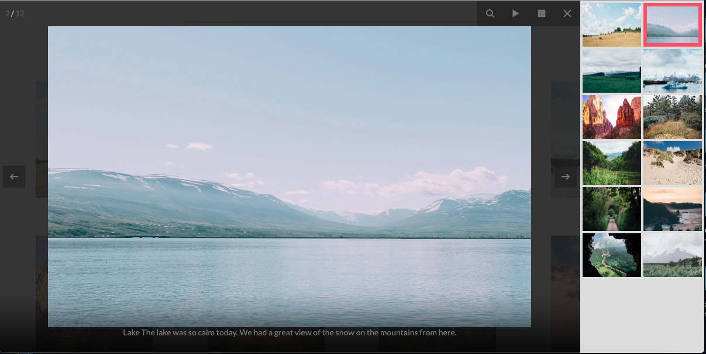
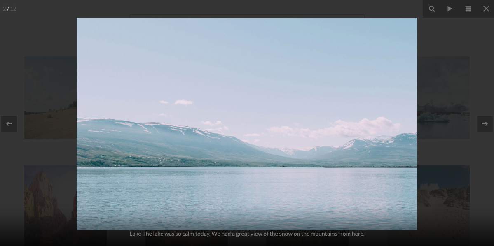

# Photo_Gallery_Techdegree
**Photo_Gallery_Techdegree** 

Photo_Gallery allows you to view some beautiful static images. These images support lightbox mode.

Photo_Gallery build with html, sass, and JQuery. 

Photo_Gallery proudly supported by [fancyBox](https://github.com/fancyapps/fancybox) Jquery plugin.

The media-query breakpoint is 768px.

You can visit the live version at [https://allan9595.github.io/photo_gallery_techdegree/](https://allan9595.github.io/photo_gallery_techdegree/)

## How to run on the local machine

git clone https://github.com/allan9595/photo_gallery_techdegree.git

Go to the folder then open the index.html file in browser. 

## Screenshots

## License

    mit

    Copyright 2019 BOHAN ZHANG